# The Team:
Peter Hindes

# The Question:
Are there distinct cultural tropes in Aboriginal and Maori storytelling, and if so what are they?

# Motivation:
I decided to pursue this question because I am an avid fan of horror movies which have a bit of a reputation for using tropes often as an in joke but also to create new experiences by subverting them. I was curious to see if there were any distinct cultural tropes in Aboriginal and Maori storytelling that we don't see in our horror movies. That is why I decided to focus mainly on horror movies with a looser focus on stories in general.

# Background:
My initial research involved reading literary analyses of general storytelling themes in aboriginal and Maori stories. The Circle & The Spiral by Eva Rask Knudson was a great resource for understanding the cultural tropes common in these stories. Her explanation of the meaning of the spiral in Maori culture was the inspiration for the (complex) design of this page. The spiral is essentially a concept that explores progression and renewal, and stands in stark contrast to linear or pyramid like progression that is common in western culture.

I read several short stories from the D'harawal people, the Aboriginal people of the Sydney area, on https://dharawalstories.com . I saw some common themes and tropes, often there are elders and traditions that the youth or a group of nefarious people ignore and some calamity happens, this usually results in some physical phenomenon that we observe in the real world, such as the existence of some species or geological formation.

I also read Tales From The Aborigines by W E Harney, this personal retelling of stories he was told by aboriginal people while living among them and advocating for them in the Australian government showed me an interesting view into the past, many of the stories recounted are personally related to the teller or someone in their tribe. Harney says that many of the campfire stories he was privy to were funny stories from recent times of misfortunes or ironies that happened to people. This perception might be influenced by the fact that many aboriginal foundational stories are not shared with outsiders and not told by those who are not elders of the tribe. He did however hear some supernatural stories that would count as dreamtime stories involving forces that shaped the natural world in the past.

Overall the background research was quite entertaining although Harney was a bit hard to read as he wrote much of what the people told him in sounds/slang versions instead of the words as they would be written from the dictionary.

# Fieldwork:
The fieldwork involved a mixture of the planned activities and visiting libraries in the cities we went to. My favorite library was the University of Auckland General Library because it felt like home as a student, and they had an exhibit/section running on Maori literature which was a gold mine for finding some pieces that I could not find online at all.

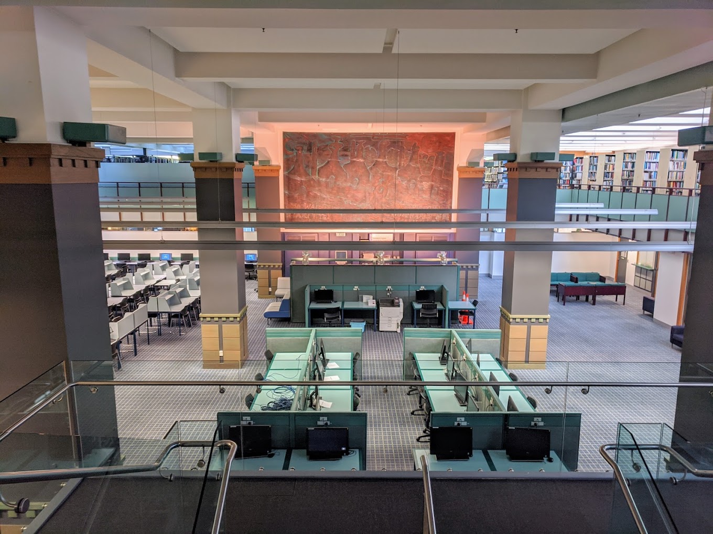

![The University of Auckland General Library, A map of New Zealand found in The New Zealand Maori by William S Dale]

UAGL was closely followed by the State Library of New South Wales in Sydney Australia which had its own art gallery and a snazzy cafe.

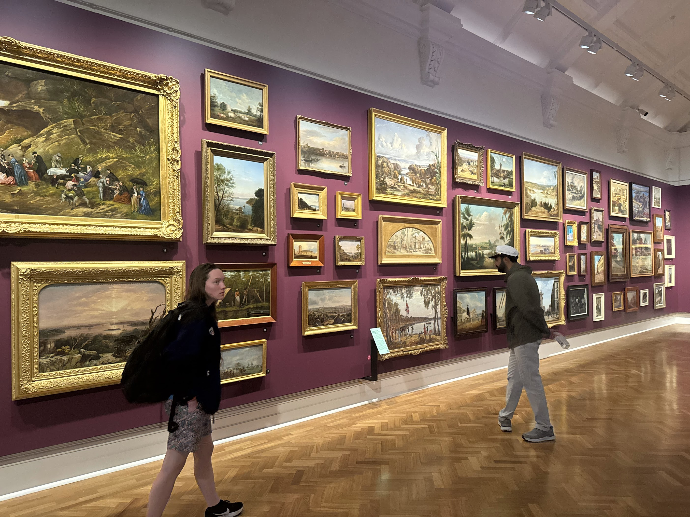

I also visited the Auckland Central City Library, it had a nice community vibe to it with lots of community services offered. I saw posters promoting community events, and a display showing some Maori art and a section on Maori writers, the top floor had the boring books in a research area with an attendant.

Overall I think New Zealand had more awareness of their indigenous people than Australia, but both were leagues ahead of the US if it was a competition. The difference can likely be explained by the fact that there are more indigenous people living in New Zealand as a percentage of the population than in Australia.

# Timeline:

# Sketches:
Lets start by looking at these illustrative sketches, I drew these to explore the themes and problem statement of the project. Through these sketches I explore a visual understanding of some tropes I have seen as well as the things I wish to address by doing this projcet.

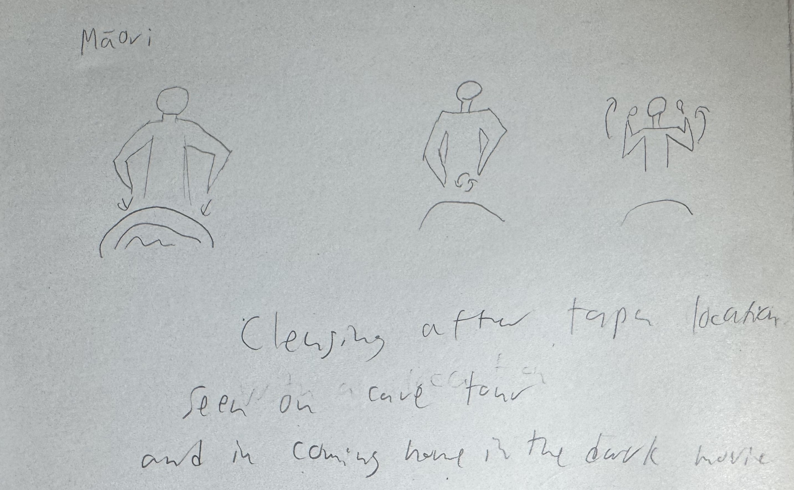
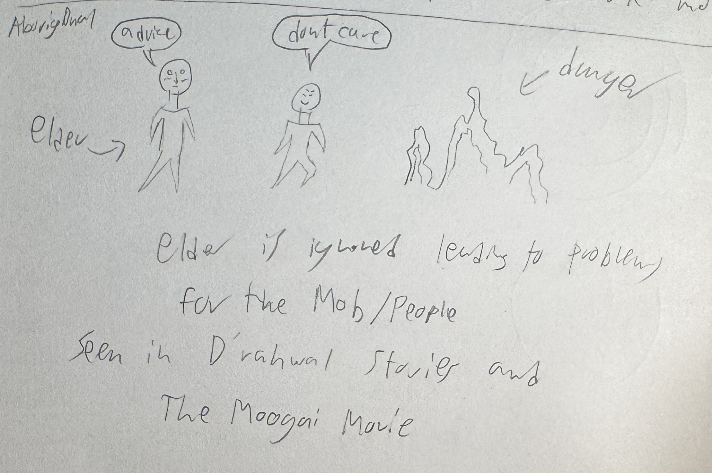
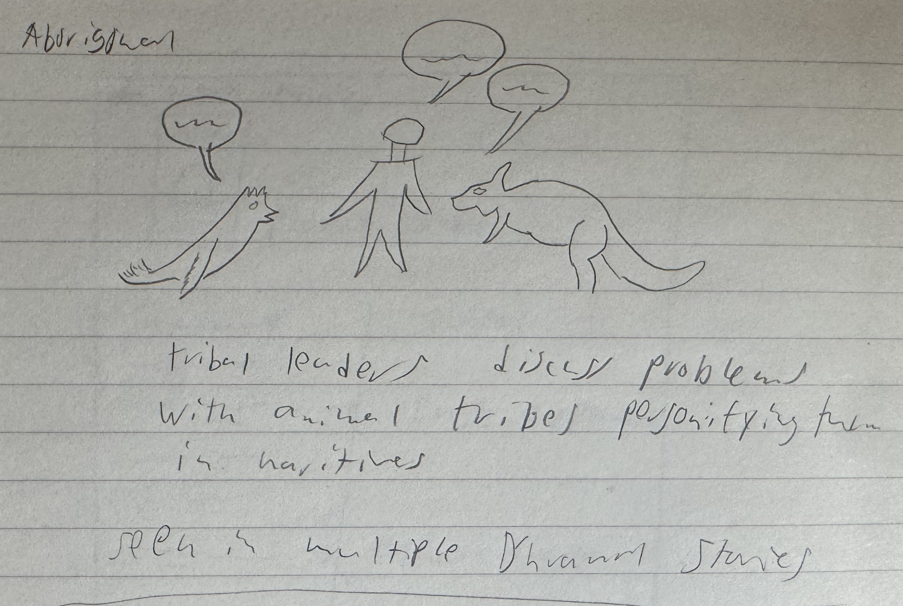
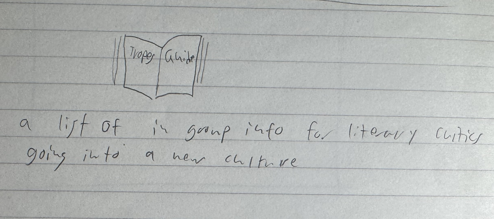
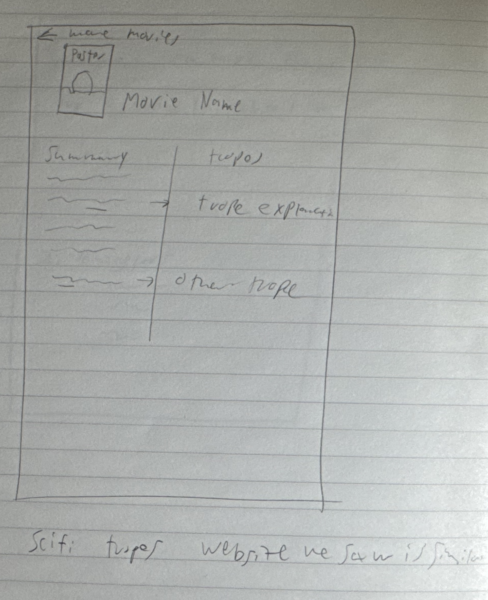
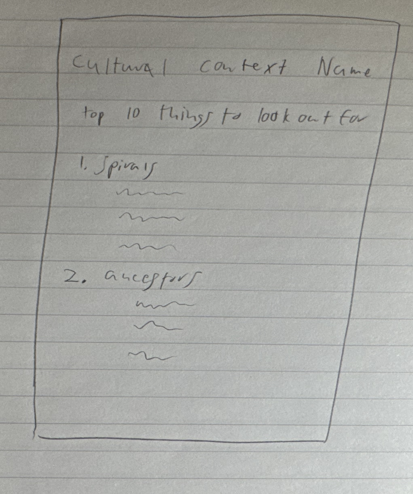
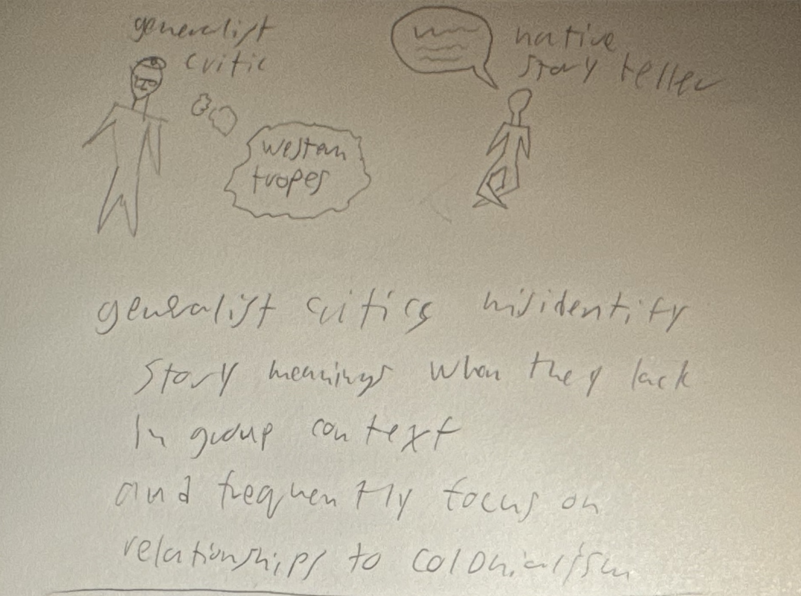
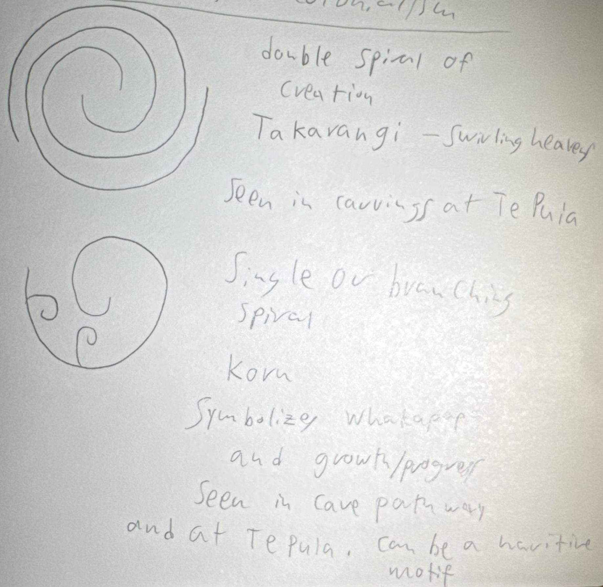

# Concluding Take-Aways:
I want to take my notes from my notebook and organize them in a database similar to the website TV tropes, I have started working on creating this and have a good framework down with the content being the only thing really lacking now, which is just a bit of copying from my notebook. From there I think the best next step would be to continue engaging with new cultures to find and catablogue their tropes like I have been. I might explore how well the "live Tweet" style of note taking works for this format, I initialy decided to use that format because I could learn the tropes through literature review at the library and then spend the afternoon watching the media and trying to call out the tropes as I see them. My general read at this point is that this has worked reasonably well but the data has a lot of extra stuff in it like my reactions to random jumpscares in the movies that means I have to sift through it a bit.

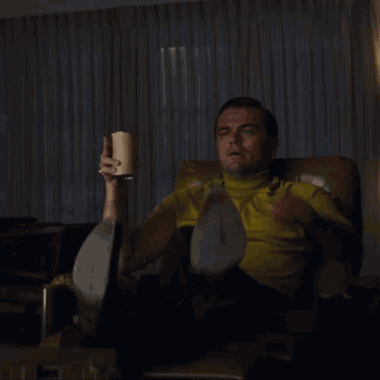
